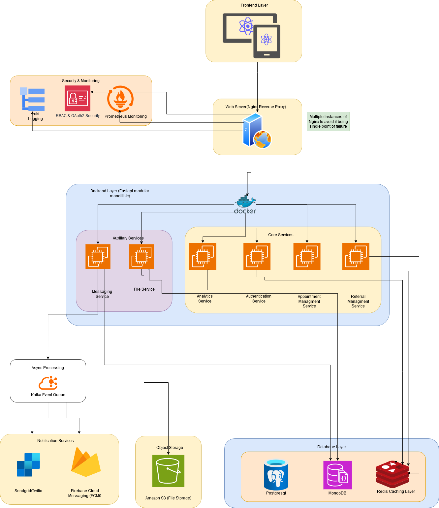

### **📌 Swiftacare MVP Architecture – Comprehensive Breakdown Including Large Organizations & Institutions**

---

## **1️⃣ User Layer**
### **👥 Diverse User Base (Clients, Providers, Institutions)**
- **Users include:**
  - **Clients (Patients):** Individuals seeking mental health services.
  - **Providers (Therapists, Psychologists, Mental Health Professionals):** Managing sessions and client data.
  - **Admin Staff:** Handling bookings, session management, and organizational tasks.
  - **Large Institutions:**
    - **Government Health Departments**: Using Swiftacare for managing public health mental wellness programs.
    - **Healthcare Institutions**: Hospitals, clinics, and private practices integrating patient sessions.
    - **Corporate & Workplace Mental Health Programs**: Companies managing employee well-being programs.

- **How They Interact with the System:**
  - **Web Application (ReactJS/Next.js)**
  - **Secure API Requests through Nginx**
  - **Admin dashboards for institutions to monitor multiple providers and patients.**
  - **Bulk appointment scheduling & data reporting for organizations.**

---

## **2️⃣ Frontend Layer (ReactJS/Next.js)**
### **🖥 Web Application**
- **Tech Stack:** **ReactJS + Next.js + TailwindCSS**
- **Core Features:**
  - **Single Platform for Individual & Institutional Users**:
    - Patients can book appointments.
    - Providers can manage clients.
    - Institutions can oversee multiple therapists & clients.
  - **Dynamic, Scalable UI** – Optimized for small clinics & large hospitals.
  - **SSO Support for Large Organizations** (OAuth2, Enterprise Authentication).
  - **Secure Data Handling** (Token-based access, JWT).

---

## **3️⃣ Nginx Reverse Proxy**
### **🛡 Secure API Gateway & Load Balancer**
- **Key Responsibilities:**
  - Handles **all API requests** between frontend & backend.
  - **Load balancing** for high availability.
  - **SSL/TLS termination** for secure data transfer.
  - Protects against **DDoS, brute force attacks**.

---

## **4️⃣ Backend Layer (FastAPI Modular Monolith)**
The **Modular Monolith** architecture **ensures flexibility**, allowing future transition into **microservices**.

### **📌 Core Services**
| **Service** | **Role** |
|------------|---------|
| **Authentication Service** | Manages user login, OAuth2, RBAC, SSO for institutions. |
| **Referral Management** | Handles client referrals & large organization bulk referrals. |
| **Appointment Management** | Schedules individual & bulk institution-based appointments. |

### **📌 Auxiliary Services**
| **Service** | **Role** |
|------------|---------|
| **Messaging Service** | Secure provider-client messaging (E2E encryption for compliance). |
| **File Service** | Manages large document uploads for institutions. |
| **Analytics Service** | Reports for individuals, clinics, and large-scale institutions. |

---

## **5️⃣ Database Layer**
### **🗄 PostgreSQL (Primary Database)**
- **Stores relational data**:  
  - Users (individuals & organizations).
  - Appointments, provider-patient relationships.
  - Role-based access permissions (RBAC).
- **Optimized with:**
  - **Partitioning for large institutions**.
  - **Read replicas** for scalability.

### **📂 MongoDB (Secondary Database)**
- **Holds unstructured data**:  
  - Large-scale institutional client logs.
  - Therapist-client encrypted chat logs.
  - System-wide event logs.

### **⚡ Redis Caching Layer**
- **Speeds up read-heavy operations**:
  - **Institutional dashboards with real-time analytics**.
  - **Fast authentication & permission checks**.

### **📦 S3 (Object Storage)**
- **Secure document storage for:**  
  - Large institutions storing compliance reports.
  - Medical document uploads.

---

## **6️⃣ Asynchronous Processing**
### **📬 Kafka Event Queue**
- **Handles background processing at scale**:
  - Bulk appointment scheduling for institutions.
  - Session logs & real-time analytics.
  - Automated reminders for individual & corporate users.

---

## **7️⃣ Security & Monitoring**
### **🔐 IAM (OAuth2 & RBAC)**
- **Manages Authentication for Individuals & Institutions**.
- **Enterprise OAuth2 integration (SSO for corporate users).**
- **Strict role-based access (Patient, Provider, Admin, Institution).**

### **📊 Prometheus (Monitoring)**
- **Tracks API & database performance** for institutional load.
- **Detects abnormal system usage (fraud prevention for institutions).**

### **📜 Loki (Logging)**
- **Captures audit logs for compliance (HIPAA, PIPEDA).**
- **Ensures large institutions meet data security policies.**

---

## **8️⃣ Large Institution-Specific Features**
| **Feature** | **Use Case** |
|------------|--------------|
| **Multi-Level Access** | Admins, Sub-Admins, Therapists, Clients under the same institution. |
| **Bulk Appointment Scheduling** | Institutions can book sessions for multiple clients at once. |
| **Automated Billing Reports (Future Expansion)** | Invoices for enterprise health insurance claims. |
| **SSO Authentication** | OAuth2 + SAML-based SSO for hospitals & corporate clients. |
| **Custom Reports & Dashboards** | Institutions see mental health trends across patients & departments. |

---

## **📌 9️⃣ Why This Works**
✅ **Scalable for Small Clinics & Large Government Institutions.**  
✅ **Optimized API & Database Performance for Enterprise Workloads.**  
✅ **Comprehensive Logging, Security, & Compliance Standards.**  
✅ **Designed for Future Growth with Modular Microservice Transition.**  

